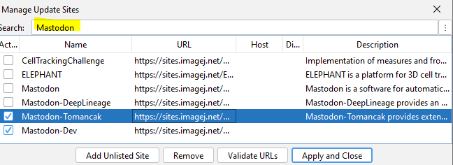
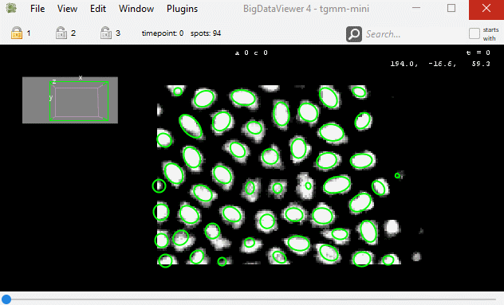

# Mastodon Tomancak - a collection of plugins to edit, analyse and visualise lineages of tracked objects.

## Table of Contents

* [Documentation of Mastodon](#documentation-of-mastodon)
* [Installation Instructions](#installation-instructions)
* [Spots management](#spots-management)
    * [Transform spots](#transform-spots)
        * [Mirror spots along X-axis](#mirror-spots-along-x-axis)
        * [Remove spots solists](#remove-spots-solists)
        * [Add center spot](#add-center-spot)
        * [Interpolate missing spots](#interpolate-missing-spots)
        * [Set radius of selected spots](#set-radius-of-selected-spots)
    * [Rename spots](#rename-spots)
        * [Label selected spots](#label-selected-spots)
        * [Change branch labels](#change-branch-labels)
        * [Systematically label spots (extern-intern)](#systematically-label-spots-extern-intern)
* [Tags](#tags)
    * [Locate tags](#locate-tags)
    * [Copy tag](#copy-tag)
    * [Add tag set to highlight cell divisions](#add-tag-set-to-highlight-cell-divisions)
    * [Create Dummy Tag Set](#create-dummy-tag-set)
* [Trees management](#trees-management)
    * [Flip descendants](#flip-descendants)
    * [Conflict resolution](#conflict-resolution)
        * [Create conflict tag set](#create-conflict-tag-set)
        * [Fuse selected spots](#fuse-selected-spots)
    * [Sort trackscheme](#sort-trackscheme)
        * [Sort lineage tree (left-right-anchors)](#sort-lineage-tree-left-right-anchors)
        * [Sort lineage tree (extern-intern)](#sort-lineage-tree-extern-intern)
        * [Sort lineage tree (cell life cycle duration)](#sort-lineage-tree-cell-life-cycle-duration)
* [Auxilliary displays](#auxilliary-displays)
    * [Show compact lineage](#show-compact-lineage)
* [Spatial track matching](#spatial-track-matching)
* [Export measurements](#export-measurements)
    * [Export spots counts per lineage](#export-spots-counts-per-lineage)
    * [Export spots counts per timepoint](#export-spots-counts-per-timepoint)
    * [Export lineage lengths](#export-lineage-lengths)

## Documentation of Mastodon

Mastodon Tomancak is an extension of Mastodon. For the full documentation of Mastodon, please visit
[mastodon.readthedocs.io](https://mastodon.readthedocs.io/en/latest/index.html).

## Installation Instructions

* Add the listed Mastodon update sites in Fiji:
    * `Help > Update > Manage update sites`
        1. `Mastodon`
        2. `Mastodon-Tomancak`
           

## Spots management

### Transform spots

#### Mirror spots along X-axis

* Menu Location: `Plugins > Spots management > Transform spots > Mirror spots along X-axis`
* The command first calculates the mean x-coordinate of all spots. Then the x-coordinate of each spot is mirrored on the
plane x = mean x. The ellipsoids are mirrored as well. The trackscheme is not modified.
* Important: The command does not support mirroring of the image data. The spots will therefore appear to be in the
  wrong
place.
* Example: 

#### Remove spots solists

#### Add center spot

#### Interpolate missing spots

#### Set radius of selected spots

### Rename spots

#### Label selected spots

#### Change branch labels

#### Systematically label spots (extern-intern)

## Tags

### Locate tags

### Copy tag

### Add tag set to highlight cell divisions

### Create Dummy Tag Set

## Trees management

### Flip descendants

### Conflict resolution

#### Create conflict tag set

#### Fuse selected spots

### Sort trackscheme

#### Sort lineage tree (left-right-anchors)

#### Sort lineage tree (extern-intern)

#### Sort lineage tree (cell life cycle duration)

## Auxilliary displays

### Show compact lineage

## Spatial track matching

## Export measurements

### Export spots counts per lineage

### Export spots counts per timepoint

### Export lineage lengths
