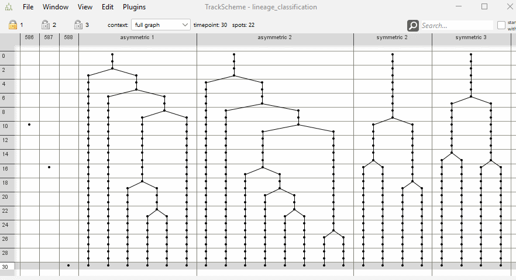
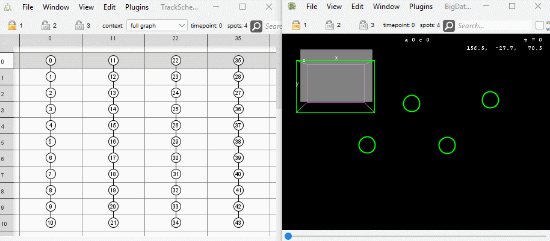
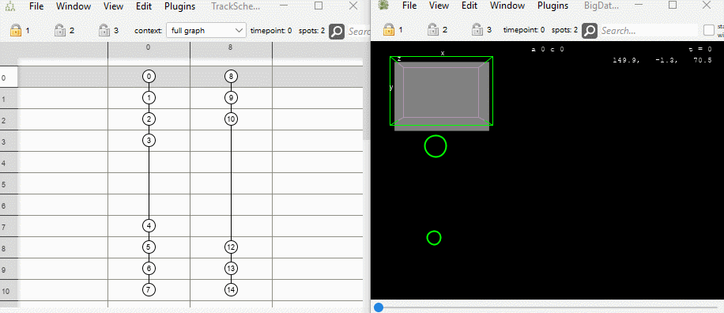
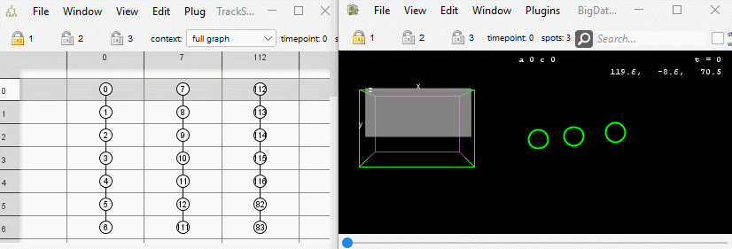
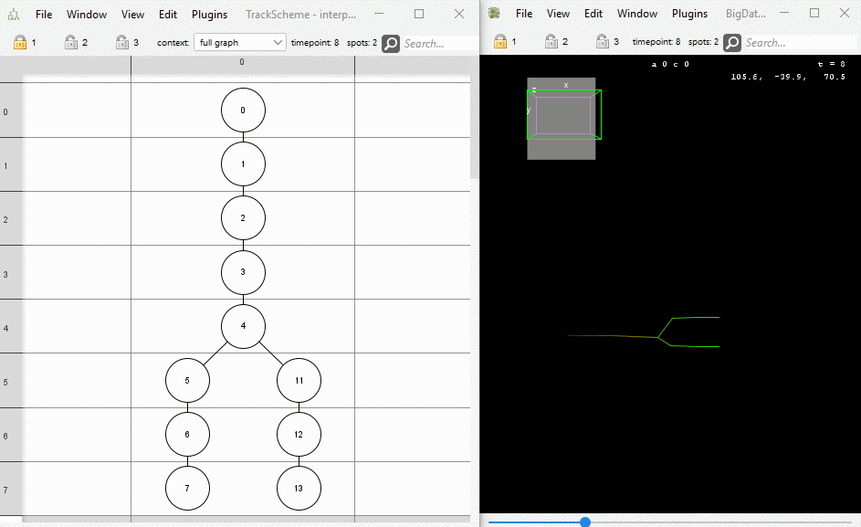
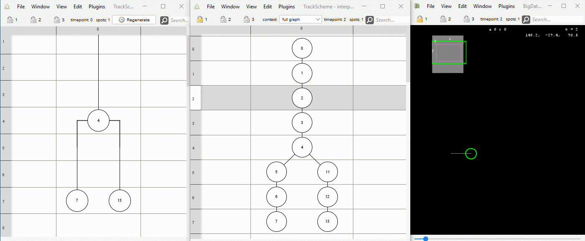
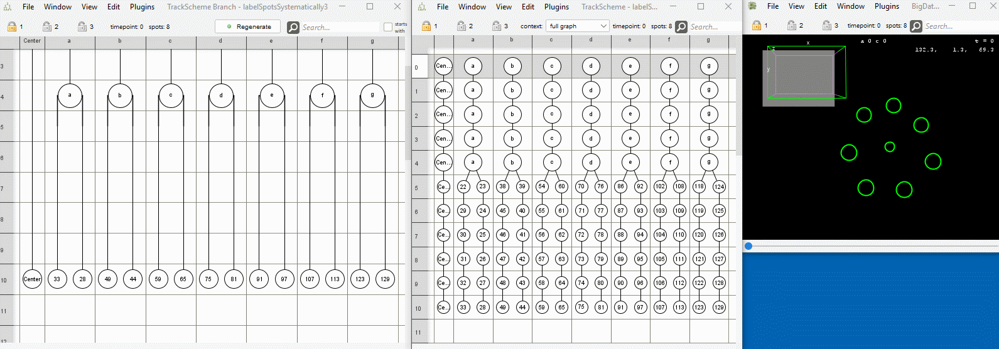
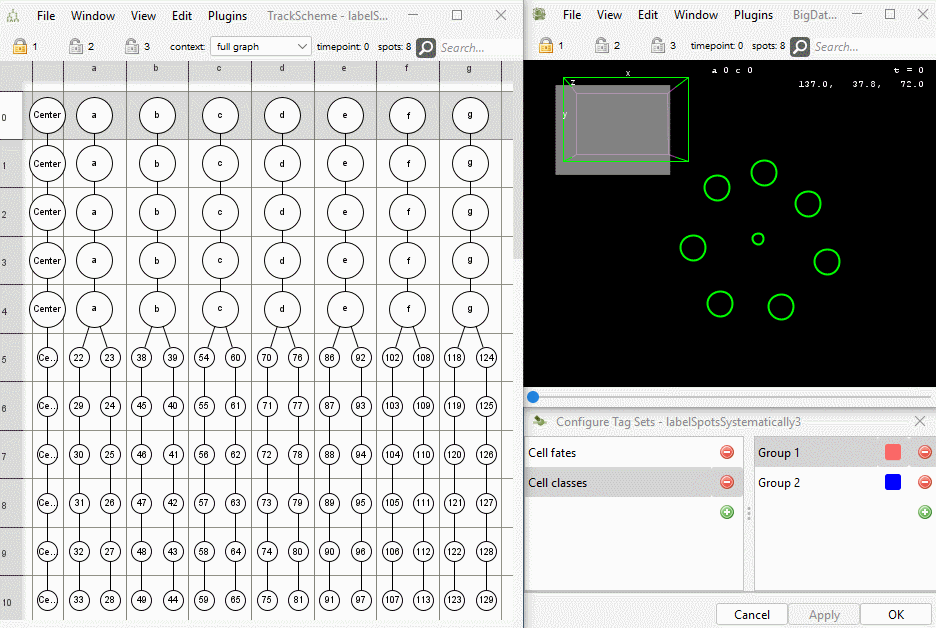
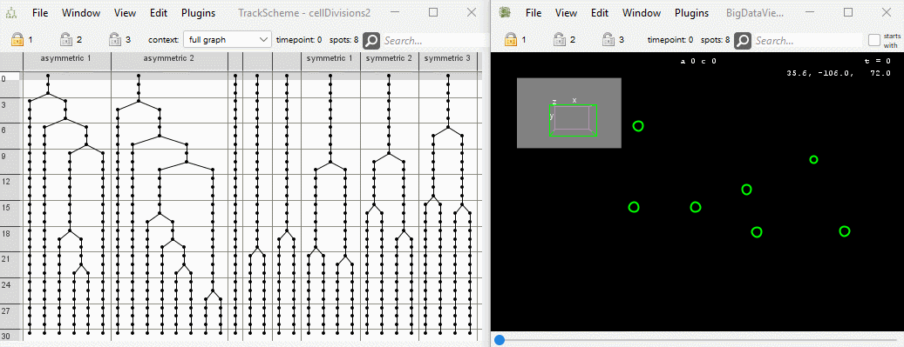

# Mastodon Tomancak - a collection of plugins to edit, analyse and visualise lineages of tracked objects.

## Table of Contents

* [Documentation of Mastodon](#documentation-of-mastodon)
* [Installation Instructions](#installation-instructions)
* [Spots management](#spots-management)
    * [Transform spots](#transform-spots)
        * [Mirror spots along X-axis](#mirror-spots-along-x-axis)
      * [Remove spots solists](#remove-isolated-spots)
        * [Add center spot](#add-center-spot)
        * [Interpolate missing spots](#interpolate-missing-spots)
        * [Set radius of selected spots](#set-radius-of-selected-spots)
    * [Rename spots](#rename-spots)
        * [Label selected spots](#label-selected-spots)
        * [Change branch labels](#change-branch-labels)
        * [Systematically label spots (extern-intern)](#systematically-label-spots-extern-intern)
* [Tags](#tags)
    * [Locate tags](#locate-tags)
    * [Copy tag](#copy-tag)
    * [Add tag set to highlight cell divisions](#add-tag-set-to-highlight-cell-divisions)
    * [Create Dummy Tag Set](#create-dummy-tag-set)
* [Trees management](#trees-management)
    * [Flip descendants](#flip-descendants)
    * [Conflict resolution](#conflict-resolution)
        * [Create conflict tag set](#create-conflict-tag-set)
        * [Fuse selected spots](#fuse-selected-spots)
    * [Sort trackscheme](#sort-trackscheme)
        * [Sort lineage tree (left-right-anchors)](#sort-lineage-tree-left-right-anchors)
        * [Sort lineage tree (extern-intern)](#sort-lineage-tree-extern-intern)
        * [Sort lineage tree (cell life cycle duration)](#sort-lineage-tree-cell-life-cycle-duration)
* [Auxilliary displays](#auxilliary-displays)
    * [Show compact lineage](#show-compact-lineage)
* [Spatial track matching](#spatial-track-matching)
* [Export measurements](#export-measurements)
    * [Export spots counts per lineage](#export-spots-counts-per-lineage)
    * [Export spots counts per timepoint](#export-spots-counts-per-timepoint)
    * [Export lineage lengths](#export-lineage-lengths)

## Documentation of Mastodon

Mastodon Tomancak is an extension of Mastodon. For the full documentation of Mastodon, please visit
[mastodon.readthedocs.io](https://mastodon.readthedocs.io/en/latest/index.html).

## Installation Instructions

* Add the listed Mastodon update sites in Fiji:
    * `Help > Update > Manage update sites`
        1. `Mastodon`
        2. `Mastodon-Tomancak`
           

## Spots management

### Transform spots

#### Mirror spots along X-axis

* Menu Location: `Plugins > Spots management > Transform spots > Mirror spots along X-axis`
* The command first calculates the mean x-coordinate of all spots. Then the x-coordinate of each spot is mirrored on the
plane x = mean x. The ellipsoids are mirrored as well. The trackscheme is not modified.
* Important: The command does not support mirroring of the image data. The spots will therefore appear to be in the
  wrong
place.
* Example: 

#### Remove isolated spots

* Menu Location: `Plugins > Spots management > Transform spots > Remove isolated spots`
* An isolated spot has no ancestors and no descendants
* The command removes all isolated spots
* Two refining conditions can be set:
    * The spot must appear in the last time point
        * Lonely spots at the end of a video are much harder to find compared to lonely spots at the beginning.
    * The spot's label consists of numbers only
        * A label that does not only consist of numbers has likely been edited by the user. A label that consists of
          number only may indicate a spot that was automatically detected and not linked to a track.
* Example: 

#### Add center spots

* Menu Location: `Plugins > Spots management > Transform spots > Add center spots`
* Adds spots to the model at the average position of the selected spots of each time point. The new spots are connected
  by links in the order of the time points.
* If there are time points without selected spots, no spot is added at that time point. In this case, the links span
  over the time points without spots.
* If there are time points with multiple selected spots, the average position of the selected spots is calculated at
  that time point.
* If no spots are selected, only a message dialog is shown.
* Example: 

#### Interpolate missing spots

* Menu Location: `Plugins > Spots management > Transform spots > Interpolate missing spots`
* Interpolates missing spots in the whole project.
* Spots are considered missing, if there is a gap of more than one time point between two spots that are connected by a
  link.
* Spots are interpolated by linearly interpolating their position and covariance matrix between the two spots that are
  connected by such a link and inserting the new spots and links between them.
* Example: 

#### Set radius of selected spots

* Menu Location: `Plugins > Spots management > Transform spots > Set radius of selected spots`
* Set the radius of all selected spots to the same value.
* Example: 

### Rename spots

#### Label selected spots

* Menu Location: `Plugins > Spots management > Rename spots > Label selected spots`
* The command opens a dialog where the user can enter a new label that will be set for all selected spots.
* Example: 

#### Change branch labels

* Menu Location: `Plugins > Spots management > Rename spots > Change branch labels`
* The command opens a dialog where the user can enter a new label that will be set for all spots that belong to the
  branch that is currently focussed. Since the label of the last spot is shown is the branch label in the trackscheme
  branch view, this operation also changes the visible label of the branch.
* Example: 

#### Systematically label spots (extern-intern)

* Menu Location: `Plugins > Spots management > Rename spots > Systematically label spots (extern-intern)`
* Derives the name of child cells from the name of the parent by appending a "1" or a "2" to the parent cell name.
* The child cell further away from the center landmark gets "1" appended.
* The child cell closer to the center landmark gets "2" appended.
* The command is useful for systematically labeling cells in a lineage tree.
* The renaming can be restricted to
    * Selected spots
    * Spots with a certain tag
    * Spots that are yet labeled with a number only (indicating that they were automatically detected and not yet
      manually labeled)
    * Spots whose names end with "1" or "2" (indicating that they were labeled with this command before)
* Example: 

## Tags

### Locate tags

* Menu Location: `Plugins > Tags > Locate tags`
* Opens a window with a list showing tracks and tags assigned to them.
  The time point and the spot (identified via its label) of the first occurrence of the tag in a track are shown.
* The user can select a tag-track combination in the list and linked views will navigate to the corresponding spot.
  The spot will be selected and highlighted.
* Tags can be removed from the selected spots.
* Example: 

### Copy tags

* Menu Location: `Plugins > Tags > Copy tag`
* Allows the user to assign a tag to spots under the condition that the spots already have a certain tag that can be
  specified by the user.
* Example: 

### Add tag set to highlight cell divisions

* Menu Location: `Plugins > Tags > Add tag set to highlight cell divisions`
* The command creates a tag set that highlights cell divisions. The user interface allows to specify the number of spots
  to highlight before and after a division.
* The colors for highlight background can be selected.
* Example: 

### Create Dummy Tag Set

## Trees management

### Flip descendants

### Conflict resolution

#### Create conflict tag set

#### Fuse selected spots

### Sort trackscheme

#### Sort lineage tree (left-right-anchors)

#### Sort lineage tree (extern-intern)

#### Sort lineage tree (cell life cycle duration)

## Auxilliary displays

### Show compact lineage

## Spatial track matching

## Export measurements

### Export spots counts per lineage

### Export spots counts per timepoint

### Export lineage lengths
