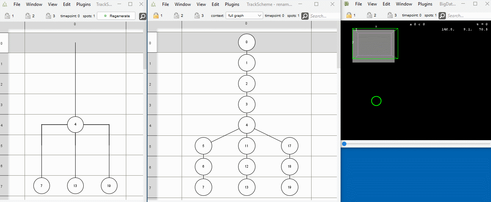

# Mastodon Tomancak - a collection of plugins to edit, analyse and visualise lineages of tracked objects.

## Table of Contents

* [Documentation of Mastodon](#documentation-of-mastodon)
* [Installation Instructions](#installation-instructions)
* [Spots management](#spots-management)
    * [Transform spots](#transform-spots)
        * [Mirror spots along X-axis](#mirror-spots-along-x-axis)
      * [Remove isolated spots](#remove-isolated-spots)
          * [Add center spots](#add-center-spots)
        * [Interpolate missing spots](#interpolate-missing-spots)
        * [Set radius of selected spots](#set-radius-of-selected-spots)
    * [Rename spots](#rename-spots)
        * [Label selected spots](#label-selected-spots)
        * [Change branch labels](#change-branch-labels)
        * [Systematically label spots (extern-intern)](#systematically-label-spots-extern-intern)
* [Tags](#tags)
    * [Locate tags](#locate-tags)
  * [Copy tags](#copy-tags)
    * [Add tag set to highlight cell divisions](#add-tag-set-to-highlight-cell-divisions)
    * [Create Dummy Tag Set](#create-dummy-tag-set)
* [Trees management](#trees-management)
    * [Flip descendants](#flip-descendants)
    * [Conflict resolution](#conflict-resolution)
        * [Create conflict tag set](#create-conflict-tag-set)
        * [Fuse selected spots](#fuse-selected-spots)
  * [Sort track scheme](#sort-track-scheme)
      * [Sort lineage tree (left-right-landmarks)](#sort-lineage-tree-left-right-landmarks)
        * [Sort lineage tree (extern-intern)](#sort-lineage-tree-extern-intern)
        * [Sort lineage tree (cell life cycle duration)](#sort-lineage-tree-cell-life-cycle-duration)
  * [Show compact lineage](#show-compact-lineage)
* [Spatial track matching](#spatial-track-matching)
* [Lineage analysis](#lineage-analysis)
    * [Show division counts over time](#show-division-counts-over-time)
* [Export measurements](#export-measurements)
    * [Export spot counts per lineage](#export-spot-counts-per-lineage)
    * [Export spot counts per time point](#export-spot-counts-per-time-point)
  * [Export division counts per time point](#export-division-counts-per-time-point)
  * [Export phyloXML for selected spot](#export-phyloxml-for-selected-spot)

## Documentation of Mastodon

Mastodon Tomancak is an extension of Mastodon. For the full documentation of Mastodon, please visit
[mastodon.readthedocs.io](https://mastodon.readthedocs.io/en/latest/index.html).

## Installation Instructions

* Add the listed Mastodon update sites in Fiji:
    * `Help > Update > Manage update sites`
        1. `Mastodon`
        2. `Mastodon-Tomancak`
           

## Spots management

### Transform spots

#### Mirror spots along X-axis

* Menu Location: `Plugins > Spots management > Transform spots > Mirror spots along X-axis`
* The command first calculates the mean x-coordinate of all spots. Then the x-coordinate of each spot is mirrored on the
plane x = mean x. The ellipsoids are mirrored as well. The trackscheme is not modified.
* Important: The command does not support mirroring of the image data. The spots will therefore appear to be in the
  wrong
place.
* Example: 

#### Remove isolated spots

* Menu Location: `Plugins > Spots management > Transform spots > Remove isolated spots`
* An isolated spot has no ancestors and no descendants
* The command removes all isolated spots
* Two refining conditions can be set:
    * The spot must appear in the last time point
        * Lonely spots at the end of a video are much harder to find compared to lonely spots at the beginning.
    * The spot's label consists of numbers only
        * A label that does not only consist of numbers has likely been edited by the user. A label that consists of
          number only may indicate a spot that was automatically detected and not linked to a track.
* Example: 

#### Add center spots

* Menu Location: `Plugins > Spots management > Transform spots > Add center spots`
* Adds spots to the model at the average position of the selected spots of each time point. The new spots are connected
  by links in the order of the time points.
* If there are time points without selected spots, no spot is added at that time point. In this case, the links span
  over the time points without spots.
* If there are time points with multiple selected spots, the average position of the selected spots is calculated at
  that time point.
* If no spots are selected, only a message dialog is shown.
* Example: 

#### Interpolate missing spots

* Menu Location: `Plugins > Spots management > Transform spots > Interpolate missing spots`
* Interpolates missing spots in the whole project.
* Spots are considered missing, if there is a gap of more than one time point between two spots that are connected by a
  link.
* Spots are interpolated by linearly interpolating their position and covariance matrix between the two spots that are
  connected by such a link and inserting the new spots and links between them.
* Example: 

#### Set radius of selected spots

* Menu Location: `Plugins > Spots management > Transform spots > Set radius of selected spots`
* Set the radius of all selected spots to the same value.
* Example: 

### Rename spots

#### Label selected spots

* Menu Location: `Plugins > Spots management > Rename spots > Label selected spots`
* The command opens a dialog where the user can enter a new label that will be set for all selected spots.
* Example: 

#### Change branch labels

* Menu Location: `Plugins > Spots management > Rename spots > Change branch labels`
* The command opens a dialog where the user can enter a new label that will be set for all spots that belong to the
  branch that is currently focussed. Since the label of the last spot is shown is the branch label in the trackscheme
  branch view, this operation also changes the visible label of the branch.
* Example: 

#### Systematically label spots (extern-intern)

* Menu Location: `Plugins > Spots management > Rename spots > Systematically label spots (extern-intern)`
* Derives the name of child cells from the name of the parent by appending a "1" or a "2" to the parent cell name.
* The child cell further away from the center landmark gets "1" appended.
* The child cell closer to the center landmark gets "2" appended.
* The command is useful for systematically labeling cells in a lineage tree.
* The renaming can be restricted to
    * Selected spots
    * Spots with a certain tag
    * Spots that are yet labeled with a number only (indicating that they were automatically detected and not yet
      manually labeled)
    * Spots whose names end with "1" or "2" (indicating that they were labeled with this command before)
* Example: 

## Tags

### Locate tags

* Menu Location: `Plugins > Tags > Locate tags`
* Opens a window with a list showing tracks and tags assigned to them.
  The time point and the spot (identified via its label) of the first occurrence of the tag in a track are shown.
* The user can select a tag-track combination in the list and linked views will navigate to the corresponding spot.
  The spot will be selected and highlighted.
* Tags can be removed from the selected spots.
* Example: 

### Copy tags

* Menu Location: `Plugins > Tags > Copy tag`
* Allows the user to assign a tag to spots under the condition that the spots already have a certain tag that can be
  specified by the user.
* Example: 

### Add tag set to highlight cell divisions

* Menu Location: `Plugins > Tags > Add tag set to highlight cell divisions`
* The command creates a tag set that highlights cell divisions. The user interface allows to specify the number of spots
  to highlight before and after a division.
* The colors for highlight background can be selected.
* Example: 

### Create Dummy Tag Set

* Menu Location: `Plugins > Tags > Create Empty Tag Set`
* Creates a tag set with a specified number of tags in random colors.
* Example: 

## Trees management

### Flip descendants

* Menu Location: `Plugins > Trees management > Flip descendants`
* Flip children of the currently selected and focused spot in the track scheme graph.
* Example: 

### Conflict resolution

#### Create conflict tag set

* Menu Location: `Plugins > Trees management > Conflict resolution > Create conflict tag set`
* During tracking it can happen that the same objects has been detected multiple times at similar positions in the
  image. The result of this are overlapping spots in the tracking data that actually represent the same object.
* This command searches for overlaps (aka 'conflicts') in the tracked spots that may indicate such situations.
* The command creates a new tag set with the name "Conflicting Spots" that contains tags for all the detected conflicts.
* Two spots are considered to be in conflict if they overlap to a certain degree.
    * More precisely, the Hellinger
      distance [1](https://en.wikipedia.org/wiki/Hellinger_distance), [2]("https://www.ncbi.nlm.nih.gov/pmc/articles/PMC3582582/figure/F11/)
      between the ellipsoids of the spots is computed.
    * The spots are considered to be in overlapping / in conflict, if the distance is below a threshold that can be set
      by the user:
        * Only spheres that strongly overlap are considered to be in conflict. (0.3)
        * Two spheres with a moderate overlap are considered to be in conflict. (0.5)
        * Two spheres that slightly touch are considered to be in conflict. (0.7)
* Example: 

#### Fuse selected spots

* Menu Location: `Plugins > Trees management > Conflict resolution > Fuse selected spots`
* The currently selected spots are fused into a single track. For each time point, the position and covariance of the
  selected spots are averaged and assigned to a fused spot.
* The selected spots must fulfill very specific requirements. As shown here:

<pre>
     before:                                 after fusion:
     (selected spots are marked with *)

     A1      B1      C1                      A1   B1  C1
     |       |       |                         \  |  /
     A2*     B2*     C2*                          A2
     |       |       |           ---&gt;             |
     A3*     B3*     C3*                          A3
     |       |       |                         /  |  \
     A4      B4      C4                      A4   B4  C4
</pre>

* The selected spots must belong to a fixed number of branches. And in each branch, the same number of spots must be
  selected and the spots must be at the same time points.
* One of the branches is considered to be the "focused" branch. (If a spot is focused that containing branch will be
  that "focused" branch.) The spots in the focused branch are kept. Their position and covariance are updated to the
  average of the selected spots of the same time point. The other selected spots, that are not in the "focused" branch,
  are removed.
* New edges are added as if the spots were actually fused.
* Example: 

### Sort track scheme

#### Sort lineage tree (left-right-landmarks)

* Menu Location: `Plugins > Trees management > Sort trackscheme > Sort lineage tree (left-right-anchors)`
* Sorts the order of sub lineages in the track scheme.
* Cell closer to the left landmark, are put to the left side.
* Cells closer to the right landmark are put to the right side.
* The user can specify the left and right landmark by selecting tracks.
* The user can specify if the entire tree should be sorted, only selected subtrees or subtrees with a specific tag.
* Example: 

#### Sort lineage tree (extern-intern)

* Menu Location: `Plugins > Trees management > Sort trackscheme > Sort lineage tree (extern-intern)`
* Sorts the order of the sub lineages in the track scheme.
* Cells further away from the center landmark, are put to the left side.
* Cells closer to the center landmark, are put to the right side.
* The user can specify the center landmark by selecting a track.
* The user can specify if the entire tree should be sorted, only selected subtrees or subtrees with a specific tag.
* Example: 

#### Sort lineage tree (cell life cycle duration)

* Menu Location: `Plugins > Trees management > Sort trackscheme > Sort lineage tree (cell life cycle duration)`
* Sort selected spots such that the child cell with the longer cell cycle duration (aka branch duration) is arranged to
  the left in the TrackScheme.
* If no spots are selected, the entire track scheme is sorted.
*
Example: 

### Show compact lineage

* Menu Location: `Plugins > Trees management > Show compact lineage`
* Shows a compact representation of the lineage tree, i.e. only the roots, leaves and spots immediately before a
  division are shown.
* Example: 

## Spatial track matching

* This command allows comparing the lineages of two similarly developing embryos stored in two Mastodon projects.
* By analyzing the spindle directions, the plugin tries to find the corresponding cells in both embryos.

### Pre-conditions

The following conditions need to be met for the algorithm to work:

* Both projects should show stereotypically developing embryos.
* The first frame should show both the embryos at a similar developmental stage. The frame number that is considered
  the first frame can be set by the user.
* Root nodes must be labeled, and the labels should match between the two projects.
* There needs to be at least three tracks with cell divisions, that can be paired based on their names.
* Note: The plugin ignores tracks that have no cell divisions.

### Operations based on the correspondence information

The plugin allows performing various operations based on the correspondence information, such as:

* Couple projects:
    * Spot highlighting and focus are synchronized between the two projects.
    * Navigation to a clicked spot is synchronized for the selected `sync group`.
    * Synchronization works best between the TrackScheme Branch and TrackScheme Hierarchy windows.
    * Synchronization is only implemented for spots, not for links.
* Sort TrackScheme based on the correspondences
    * Orders the descendants in the TrackScheme of the chosen project such that their order matches the order in the
      other project.
* Copy cell names
    * The correspondences are on the level of cells. This is why all the spots that belong to the same cell will get
      the same label. Labels of individual spots can not be copied.
    * The label of the first spot of a cell is assumed to be the cell name.
    * This assumption is different from the TrackScheme Branch. Which actually shows the label of the last spot as
      the label of the branch.
* Copy tags between the corresponding cells in both embryos:
    * Use the found correspondences to copy a tag set from one project to the other.
    * The correspondences are on the level of cells / branches thus tags are only copied if the entire cell / branch
      is tagged. Tags on individual spots are not copied.
* Plot cell division angles
    * Show a plot of angles between paired cell division directions over time
* Add angles to table
    * Stores the angles between paired cell division directions as a feature in both projects.
* Color paired lineages
    * Creates a new tag set `lineages` in both projects. Lineages with the same root node label get a tag with the
      same color.

### Parameters and Track Matching Methods

* project A: the first project to compare
* project B: the second project to compare
* First frame: The first time point of a project to be used for the registration.
    * This is useful if
        * both projects start at different stages of development
            * e.g. one project starts at the 4-cell stage and the other at the 8-cell stage
            * in this case, the user can set the first frame of both projects to the same stage (i.e. the 8-cell stage)
        * there are less than three cells in the first time point
            * in this case, the user can set the first frame to a later time point where there are at least three cells
              in both projects.
* Spatial track matching method:
    * Fixed spatial registration based on root cells
        * Pairs of root cells with the same name are used to estimate the transformation between the two embryos.
    * Dynamic spatial registration based on root cells and their descendants
        * Pairs of root cells with the same name in both projects and respective descendants are used to estimate the
          transformation between
          the two embryos. The transformation is stabilized by averaging over the descendants of the root cells.
    * Dynamic spatial registration based on "landmarks" tag set
        * The user can define "landmark" spots in both projects. These spots need to be tagged with the same tag of a
          tag set called "landmarks" in both projects. The transformation is estimated based on the positions of the
          landmarks.

### Example

* project A (left
  side): [Phallusia mammillata](https://github.com/mastodon-sc/mastodon-example-data/blob/master/astec/Pm01.mastodon)
* project B (right
  side): [Phallusia mammillata](https://github.com/mastodon-sc/mastodon-example-data/blob/master/astec/Pm02.mastodon)
* Visualisation: 

## Lineage analysis

### Show division counts over time

* Menu Location: `Plugins > Lineage analysis > Show division counts over time`
* The command shows a plot of the number of divisions over time.
* It is possible to set a window size, which is used to compute a sliding average.
* A division is defined as a spot with more than one outgoing edge.
* Example: 

## Export measurements

### Export spot counts per lineage

* Menu Location: `File > Export > Export measurements > Spot counts > Export spot counts per lineage`
* Export spots counts per lineage per time point.
* If spots are selected, only lineages with selected spots are included, otherwise all lineages are included.
* Results in one CSV file per lineage.
* Example: 

### Export spot counts per time point

* Menu Location: `File > Export > Export measurements > Spot counts > Export spot counts per time point`
* This command writes the time point and the number of spots at each time point to a single CSV file.
* Example: 

### Export division counts per time point

* Menu Location: `File > Export > Export measurements > Export division counts per time point`
* This command writes the time point and the number of divisions at each time point to a single CSV file.
* A division is defined as a spot with more than one outgoing edge.
* Example: 

### Export phyloXML for selected spot

* Menu Location: `File > Export > Export phyloXML for selected spot`
* Export the subtree of the selected spot in phyloXML format.
* The phyloXML format is a standard for representing phylogenetic trees: [phyloxml.org](http://www.phyloxml.org/)

## Merge Projects

* Menu Location: in FIJI (not in Mastodon) `Plugins > Tracking > Mastodon > Merge Two Projects`
* The command is able to merge tracking data from two projects that refer to the same image data.
* Tracking data from the `Project B` is added to the `Project A` and the result is opened in a new project, which can be
  saved by the user.
* While merging `Project B` into `Project A`, the command tries to omit spots and links from `Project B` that already
  exist in `Project A`. The detection of duplicates is based on spatial proximity.
* The parameters `Absolute distance cutoff` and `Mahalanobis distance cutoff` can be used to adjust the sensitivity of
  the duplicate detection. Higher values will lead to more spots and links being considered as duplicates and thus in
  less spots and links being added to the merged project.
* Example:
    * Input projects (left `Project A`, right
      `Project B` ):
      

    * Resulting project:
      
